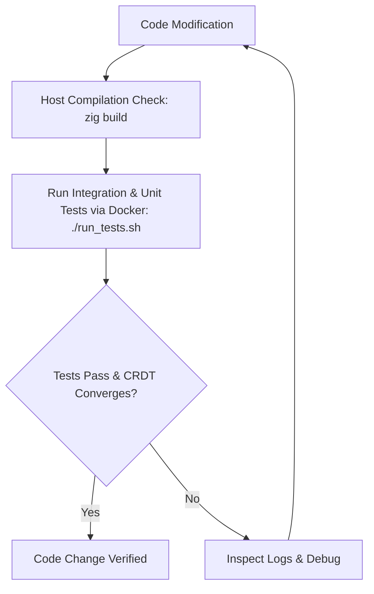

# Apex CRDT Database Developer & Agent Guide (`AGENTS.md`)

This document provides system architecture context, test suite workflows, and verification strategies to ensure that any code changes maintain correctness, test coverage, and CRDT convergence under race conditions.

---

## 1. Project Context & Architecture

Apex is a distributed, schema-aware, conflict-free replicated database written in Zig (0.13.0). It leverages Gossip for node discovery, a custom TCP binary protocol for low-overhead communication, and background anti-entropy push-delta replication to ensure eventual consistency.

### Component Map
- **Storage Engine** (`src/storage/engine.zig`):
  - Declares the core CRDT cell structures: `lww_register` (Last-Write-Wins), `pn_counter` (Positive-Negative Counter), and `aw_set` (Add-Wins Set).
  - Implements cell-level merging logic via `applyUpdateOptimized()`.
- **Database Controller** (`src/db.zig`):
  - Manages table and schema registries.
  - Implements high-level transaction/op handlers: `processMutation()` (handles client writes as well as incoming replication syncs) and `processQuery()`.
  - Maintains the transactional oplog used for delta sync.
- **Protocol Envelope** (`src/protocol/frame.zig`):
  - Defines the 20-byte binary header used to route packets.
- **Gossip Discovery** (`src/replication/gossip.zig`):
  - Periodically broadcasts node existence and registers seeds.
- **Delta Replication** (`src/replication/manager.zig`):
  - A background anti-entropy daemon that gathers recent oplog mutations (under 5 seconds old) and pushes them to peer nodes.
- **TTL Janitor** (`src/storage/janitor.zig`):
  - Background purger that deletes rows that have surpassed their configured TTL.
- **Dynamic Schema Parser** (`src/schema/parser.zig`):
  - Parses SQL-like definitions (e.g. `CREATE TABLE users { name: TEXT, karma: INT, friends: SET }`) into runtime schema structures.

---

## 2. Strategy for Verifiable Outcomes

To ensure the stability and correctness of the database, every agent must follow this automated verification sequence on **every** code change:



### Verification Commands

1. **Local Compilation Check**:
   Confirm your Zig code compiles:
   ```bash
   zig build
   ```
   *Note: If your host's Zig version is incompatible with v0.13.0, compilation may fail on your host. In this case, compile and run directly via Docker.*

2. **Automated Verification Pipeline**:
   The primary testing pipeline runs inside Docker Compose. Run the following command from the project root:
   ```bash
   ./run_tests.sh
   ```
   This script:
   - Rebuilds the Docker images using the local source code.
   - Spins up a 3-node cluster configured via `docker-compose.yml`.
   - Runs client mutation, schema registration, and query integration tests.
   - Runs **host-less unit tests** inside the database container.
   - Runs the **CRDT race condition and concurrency integration tests**.
   - Shuts down the cluster and cleans up resources.

---

## 3. CRDT Verification & Race Condition Strategy

Because this is a distributed CRDT database, the most critical class of bugs involves **divergent states** or **lost updates** when multiple nodes receive writes concurrently. When modifying storage engine logic or replication protocol code, you must verify that all three CRDT types behave correctly under race conditions.

### CRDT Types & Race Resolution Rules

| CRDT Type | Zig Type | Conflict Resolution Rule | Concurrency Behavior |
| :--- | :--- | :--- | :--- |
| **LWW Register** | `lww_register` | Last-Write-Wins based on physical timestamp (monotonic `milliTimestamp`). In case of a tie, the higher `node_id` wins. | If Node A updates Key X to "Alice" at `t1`, and Node B updates Key X to "Bob" at `t1` (tie), the node with the higher ID decides the resolved value. |
| **PN Counter** | `pn_counter` | Positive-Negative Counter. Merges updates from all nodes by summing their individual node counters. | If Node A adds `+10` and Node B adds `+20` concurrently, the final value converges to `+30`, regardless of which delta arrives first. |
| **AW Set** | `aw_set` | Add-Wins Set. Retains elements when concurrent adds and removes happen. | If Node A adds "Apple" and Node B adds "Banana" concurrently, the final set contains `["Apple", "Banana"]`. |

### Race Condition Integration Test (`tests/crdt_race_test.zig`)

We have created an integration test specifically designed to verify CRDT convergence under race conditions and concurrent write paths:
- **LWW Register Tie-Breaking**: Sends mock `.sync` updates with identical timestamps but differing Node IDs to verify that tie-breaking rules function deterministically and that lower-timestamped writes are safely ignored.
- **PN Counter Concurrency**: Sends concurrent increments to separate nodes (Node 1 and Node 2) and asserts that both nodes eventually converge to the correct sum after replication.
- **AW Set Concurrency**: Sends concurrent additions of different values to separate nodes and asserts that both values are preserved on all nodes.

### Writing New Concurrency Tests
When adding new CRDT types or editing replication paths, you must expand either the unit tests in `src/storage/engine.zig` or the integration tests in `tests/crdt_race_test.zig`.
- Use the **Sync Message Pattern** (setting `msg_type = .sync`) to test deterministic race resolution with fixed timestamps.
- Use the **Replication Sleep Pattern** (mutating separate ports, sleeping for `6` seconds for anti-entropy replication, and querying all ports) to test eventual convergence.

---

## 4. Test Coverage Guidelines

When submitting changes, you must ensure appropriate test coverage:

### Unit Test Checklist
- **Path**: Inside `src/storage/engine.zig` or a dedicated module.
- **Target**: Isolated functions, algorithms, and logic (e.g., individual `applyUpdateOptimized` logic, payload parsing edge cases, mathematical operators).
- **Execution**: Run via `docker compose exec -T node1 zig build test` (part of `./run_tests.sh`).

### Integration Test Checklist
- **Path**: Inside `tests/` and registered in `build.zig` under the `tests` array.
- **Target**: End-to-end network behaviors, TCP connections, schema registrations, replication loops, and cluster eventual consistency.
- **Execution**: Run via `./run_tests.sh`.

### Agent Verification Protocol
Before marking a task as done, you must verify:
1. `docker compose exec -T node1 zig build test` reports all green unit tests.
2. `./run_tests.sh` finishes with `=== All tests executed successfully! ===`.
3. Check the output logs to ensure that your new tests compiled and were executed.

---

## 5. Companion Client Script Maintenance (`client.py`)

We provide a lightweight Python companion test utility [client.py](file:///Users/jordan.shaw/Development/zig/database/client.py) in the root directory to allow direct reads/writes and schema registrations from CLI/scripts.

Whenever new database operations, columns types, CRDT cells, or replication messages are added to the codebase:
- **You must update `client.py`** to support these features independently.
- Keep the CLI usage messages and parameters aligned with the database capabilities.
- Ensure any modifications to the custom binary packet structure (header or payload serialization) are mirrored inside `client.py`'s packaging logic.
